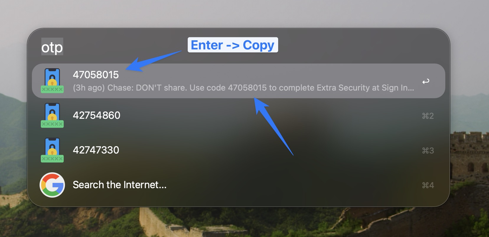

# Alfred iMessage OTP


Alfred workflow to grab OTP codes from recent iMessages and copy them to clipboard.

macOS's built-in verification code autofill doesn't work in Chrome, so this provides a quick `otp` keyword to grab codes.

<p align="center">
  
</p>

## Installation

1. Download the `.alfredworkflow` file from [Releases](https://github.com/sherifabdlnaby/alfred-imessage-otp/releases)
2. Double-click to install in Alfred
3. Grant **Full Disk Access** to Alfred (System Settings → Privacy & Security → Full Disk Access)

### Verifying the download

Each release bundle carries build provenance. Verify it came from this repo's pipeline before installing:

```sh
gh attestation verify alfred-imessage-otp-<version>.alfredworkflow --owner sherifabdlnaby
```

## Usage

Type `otp` in Alfred to see recent verification codes from your iMessages.

- Select a code to copy it to clipboard
- Press `⌘L` on any result to see the full message text

## How it works

Reads the last 50 received messages from the past 24 hours from the iMessage database and extracts verification codes using:

1. **Keyword-anchored matching** - codes near words like "code", "OTP", "PIN", "verification", "passcode"
2. **Broad fallback** - any 4-8 digit number (filtering out years and round numbers)

## Requirements

- macOS
- [Alfred](https://www.alfredapp.com/) with Powerpack
- Full Disk Access for Alfred

## Development

This repo uses [**mise**](https://mise.jdx.dev) to pin its tools (Node, linters), expose tasks, and wire git hooks, so everyone builds with the same versions and commands.

<details>
<summary><b>Install mise (first time on this machine)</b></summary>

```sh
brew install mise          # or: curl https://mise.run | sh
echo 'eval "$(mise activate zsh)"' >> ~/.zshrc   # bash: mise activate bash >> ~/.bashrc
mise doctor                # confirm the install is healthy
```

See the [installation docs](https://mise.jdx.dev/installing-mise.html) for other platforms.

</details>

Set up the project from the repo root:

```sh
mise trust      # allow this repo's mise config to load
mise run setup  # install pinned tools + deps (git hooks self-install via mise)
```

Everyday commands:

| Command                                  | What it does                                                          |
| ---------------------------------------- | --------------------------------------------------------------------- |
| `mise run check` (alias `mise run lint`) | Run all linters, formatters, and validators. Add `--fix` to auto-fix. |
| `mise run build`                         | Zip `src/` into the `.alfredworkflow`.                                |
| `mise run clean`                         | Remove `build/` and `src/node_modules/`.                              |
| `mise tasks`                             | List every available task.                                            |

Run `mise run <task> --help` for a task's options.

On **commit**, [hk](https://hk.jdx.dev) formats and lints your staged files — the same `check` that runs in CI, so problems surface before you push. Skip it for a WIP commit with `git commit --no-verify`.

## Credits

Icon by [juicy_fish on Freepik](https://www.freepik.com/icon/passcode_9723037)
